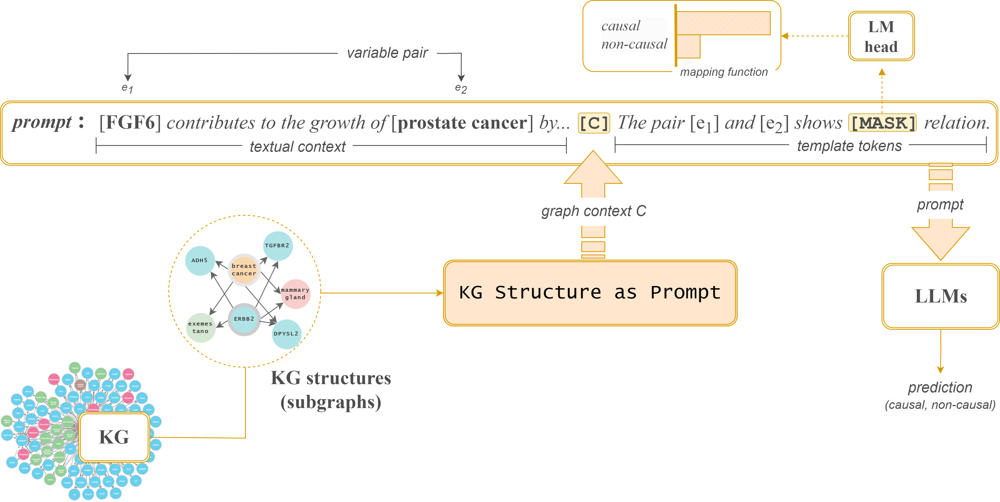

# Supplementary materials for AgrRE project: 
### AgrRE: Attention Guided and Multi-Scale Graph Convolutional Network for Relation Extraction from Chinese Agricultural-Aware Text

including the [datasets](datasets/), [codes](source-code/), and an [appendix](other-materials/Appendix.pdf) containing the hyperparameters settings and other technical details.

#### Requirements
```pip install -r requirements.txt```

#### Training
Conventional fine-tuning: `bash run_conv.sh`

(complete readme and code to-be-added)


